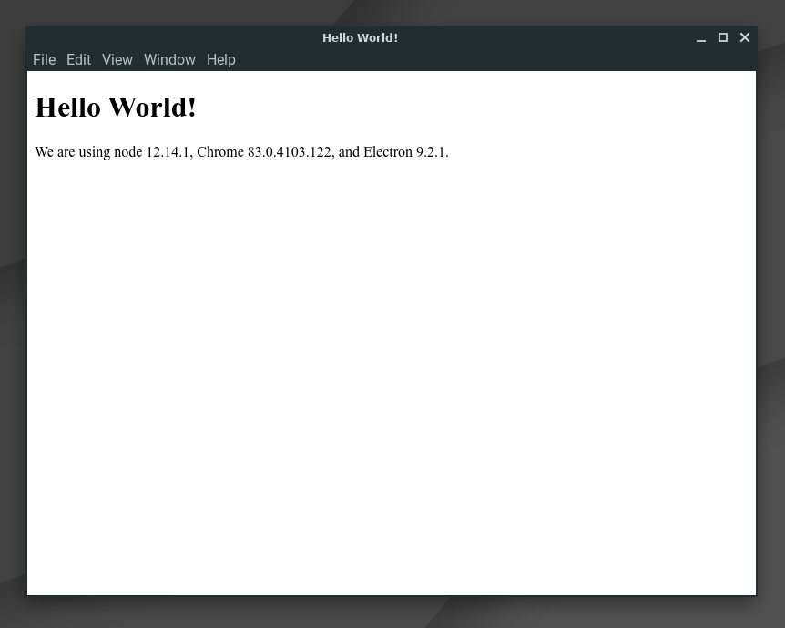

# Electron.js Quickstart
> Boilerplate for a simple Electron app

[](https://github.com/MichaelCurrin/electron-quickstart/tags/?include_prereleases&sort=semver)
[](#license)


<div align="center">

[](https://github.com/MichaelCurrin/electron-quickstart/generate)

</div>

Electron is a JavaScript framework which lets you write desktop applications. Such as Facebook Messenger, Slack and Visual Studio Code. This project is a template to help you learn the basics and get a Hello World project running with minimal effort.


## Preview

<div align=center>
    
</div>


## Resources

- Electron homepage 
    - https://www.electronjs.org/
    >  Build cross-platform desktop apps with JavaScript, HTML, and CSS
- Electron apps
    - https://www.electronjs.org/apps
    - Marketplace of free Electron-based apps, including download links and links to their GitHub source code
- Electron docs 
    - https://www.electronjs.org/docs
    - Docs for developers making Electron apps.
- [electron/electron-quick-start](https://github.com/electron/electron-quick-start) repo - see the code and also the resources in the README file.


## Create your own app from scratch

This project's contents and the steps this section are based on the intro tutorial in the docs.

- [Writing Your First Electron App](https://www.electronjs.org/docs/tutorial/first-app)

```sh
$ mkdir my-app
$ npm init
$ npm install --save-dev electron
```

Setup these files at minimum:

- `index.html`
- `main.js`

Copy the content from the tutorial or from the scripts in this repo.

Add this to the `scripts` section of `package.json` - `"start": "electron ."`. 

Note that using `node main.js` will not work - the `require('electron')` import will just return a string (a path like `'.../node_modules/electron/dist/electron'`) and `app` will cause errors as it is undefined.

Run your app with:

```sh
$ npm start
```


## Installation

Install Node.js.

Clone the repo.

Install dependencies.

```sh
$ npm install
```


## Usage

```sh
$ npm start
```
